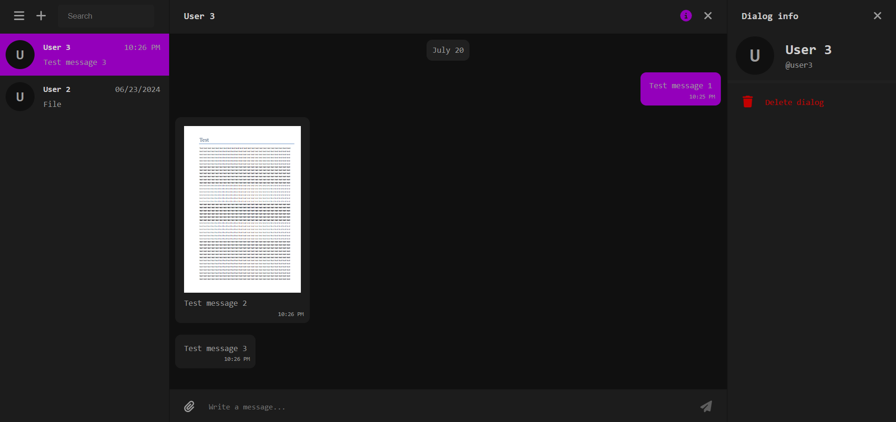

# messenger-web-client




## Available scripts

In the project directory, you can run:

- `npm start` - runs the app in the development mode
- `npm run build` - builds the app for production to the `build` folder

In development mode, specify the server address in the env variable `PROXY`:

```
PROXY=http://localhost:4000
```

In production mode, configure proxying of `/api/..` requests to the server address. Nginx example:

```
server {
  listen 80;

  location / {
    root   html;
    index  index.html;
  }

  location /api {
    proxy_pass http://localhost:4000/api;
    proxy_buffering off;
  }
}
```

## License

[MIT](./LICENSE)
